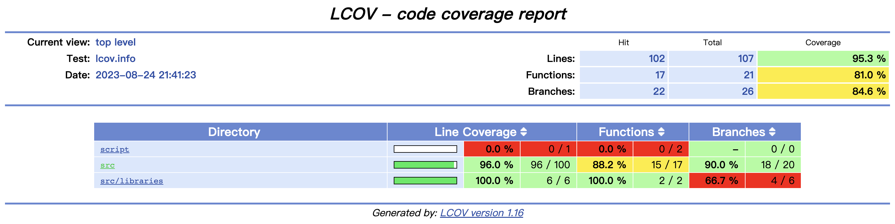
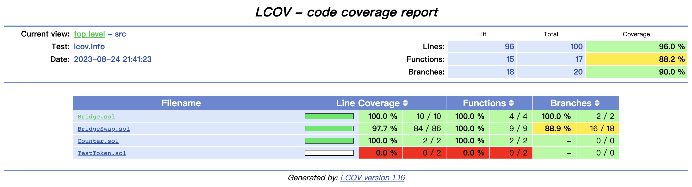

# Introduce

The smart contract project of **PolyCross** uses Foundry for testing.

## Feature

- Users can perform token swaps while crossing chains simultaneously.
- Users can add and remove liquidity.
- By referencing Uniswap-v4, multiple token pools are consolidated into a single contract, significantly reducing gas consumption.
- Cross-chain transactions will be captured by the backend monitoring system.

## Coverage Report

Top Level

Src

